## { data-state="cover-slide" data-background-image="images/cover.png" data-background-size="cover" visibility="uncounted"}

## Motivation 

  - [Evaluate dynamic predictions]{style="color:#F55129;"} of imminent delivery ([7 days]{style="color:#F55129;"}) in pregnancies complicated by early-onset fetal growth restriction.
  - [Main goal]{style="color:#F55129;"} $\longrightarrow$ optimizing antenatal corticosteroid (CCS) administration

  

  - [OPTICORE]{style="color:#F55129;"} data $\longrightarrow$ multicenter cohort study in the Netherlands

## Asymmetric misclassification 

  

  [TP]{style="color:#228B22;"}

  [FP]{style="color:#F55129;"}

  [TN]{style="color:#228B22;"}

  [FN]{style="color:#D30000;"}

## Definitions and notation

- $i=1,\dotsc,n$ individuals
-   $\require{color}\textcolor{#F55129}{T_i^*}$ true time until event
-   $\require{color}\textcolor{#F55129}{C_i}$ right-censoring times
-   $\require{color}\textcolor{#F55129}{T_i=\min(T_i^*, C_i)}$ observed times
-   $\require{color}\textcolor{#F55129}{\delta_i=\mathbf{1}\{T_i^*\leq C_i\}}$ censoring indicator
-   $\require{color}\textcolor{#F55129}{L_i}$ left-truncation times
-   $\require{color}\textcolor{#F55129}{\boldsymbol{\mathcal{H}}_i(t)}$ available history at time $t$

  - [Dynamic predictions]{style="color:#F55129;"}

  $$
  \normalsize\require{color}
  \pi_{i}(s \mid t)=\operatorname{Pr}\left(T_{i}^* \leq t+s \mid T_{i}^*>t, \colorbox{#F55129}{$\color{#ffffff}\boldsymbol{\mathcal{H}}_i(t)$}\right)
  $$

  

## Scoring rules

  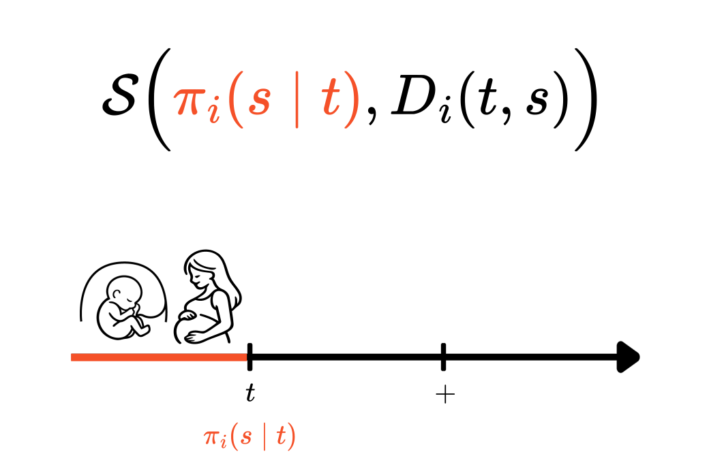

  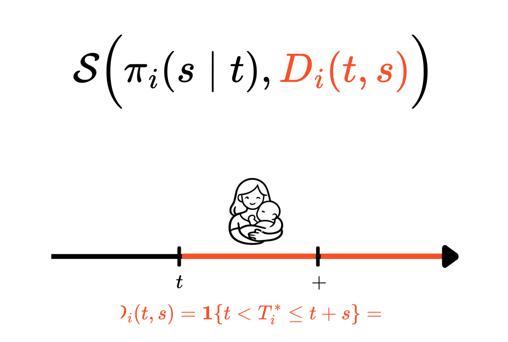

  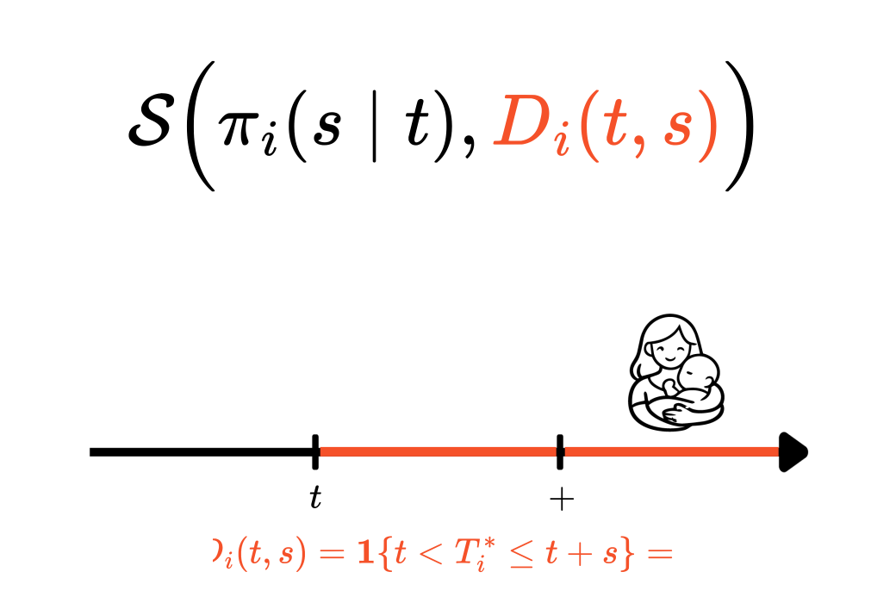

  - A scoring rule is [proper]{style="color:#F55129;"} if 
  
  $$ E\left[\mathcal{S}\big(\pi_i^{\text{true}}(s\mid t), D_i(t,s)\big) \right] \leq E\left[\mathcal{S}\big(\widehat{\pi}_i(s\mid t), D_i(t,s)\big) \right]. $$
  
  - It is [strictly proper]{style="color:#F55129;"} if it holds with equality if and only if $\pi_i^{\text{true}}(s\mid t)\equiv \widehat{\pi}_i(s\mid t)$.

  - It is [centered]{style="color:#F55129;"} if $\mathcal{S}(1,1)=\mathcal{S}(0,0)=0$.

  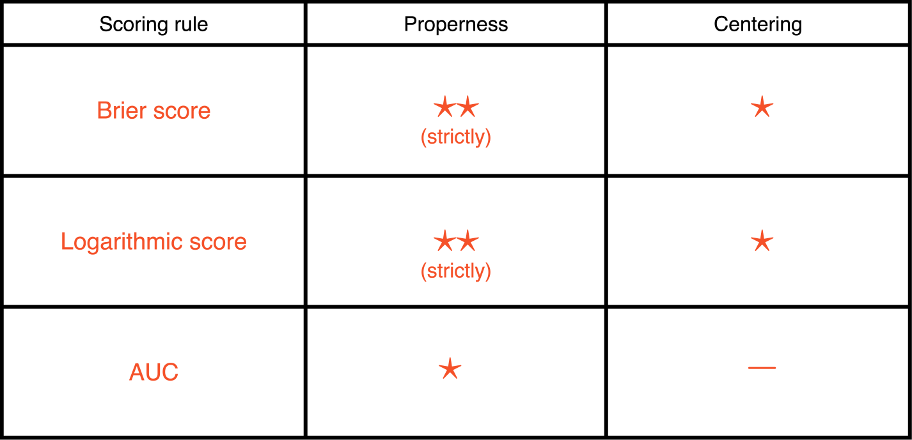

  

  

## Clinical utility 

  - Focus on the [quality of decisions]{style="color:#F55129;"} driven by dynamic predictions.
  

  - Based on a clinically relevant [decision threshold]{style="color:#F55129;"} $c\in(0,1)$.

  

  - Widely used clinical utility metric $\longrightarrow$ [net benefit (NB)]{style="color:#F55129;"}
  - [Expected cost (EC)]{style="color:#F55129;"}:
  
$$\normalsize\require{color}\begin{split}
        \begin{split}
        \text{EC}_c\big(\pi_i(s\mid t),\, & D_i(t,s)\big) =  c\mathbf{1}\{\pi_i(s\mid t)\geq c\} (1-D_i(t,s))\\
        &+(1-c)\mathbf{1}\{\pi_i(s\mid t)< c\}D_i(t,s)
    \end{split}
    \end{split} $$ 

  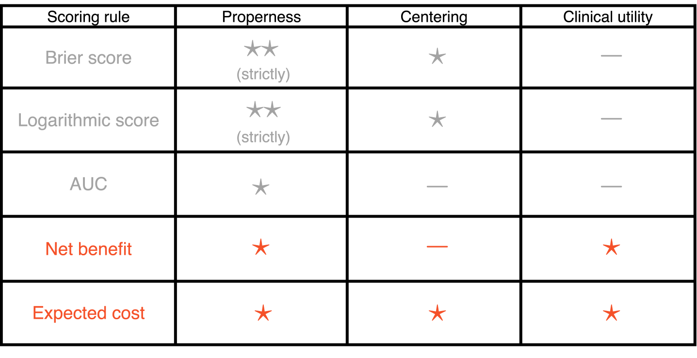

  

## Integrated weighted expected cost 

  - To avoid reliance on a single $c$ and achieve strict properness:
  
  $$\normalsize\require{color}\begin{split} & \text{IWEC}_w \big(\pi_i(s\mid t), D_i(t,s)\big) = \\ & \int_0^1\text{EC}_c\big(\pi_i(s\mid t),D_i(t,s)\big)w(c)dc \end{split} $$
  
  - $w(\cdot)$ $\longrightarrow$ positive weight function reflecting the [clinical relevance of different $c$'s]{style="color:#F55129;"}

  - To avoid reliance on a single $c$ and achieve strict properness:
  
  $$\normalsize\require{color}\begin{split} & \text{IWEC}_w \big(\pi_i(s\mid t), D_i(t,s)\big) = \\ & \textcolor{#F55129}{\int_0^1}\text{EC}_c\big(\pi_i(s\mid t),D_i(t,s)\big)\textcolor{#F55129}{w(c)dc} \end{split} $$
  
  - $w(\cdot)$ $\longrightarrow$ positive weight function reflecting the [clinical relevance of different $c$'s]{style="color:#F55129;"}

  - To avoid reliance on a single $c$ and achieve strict properness:
  
  $$\normalsize\require{color}\begin{split} & \text{IWEC}_w \big(\pi_i(s\mid t), D_i(t,s)\big) = \\ & \textcolor{#F55129}{\int_0^1}\text{EC}_c\big(\pi_i(s\mid t),D_i(t,s)\big)\textcolor{#F55129}{w(c)dc} \end{split} $$
  
  - In practice $\longrightarrow$ [beta family]{style="color:#F55129;"} of weight functions [$w(c;\alpha,\beta)$]{style="color:#F55129;"}

  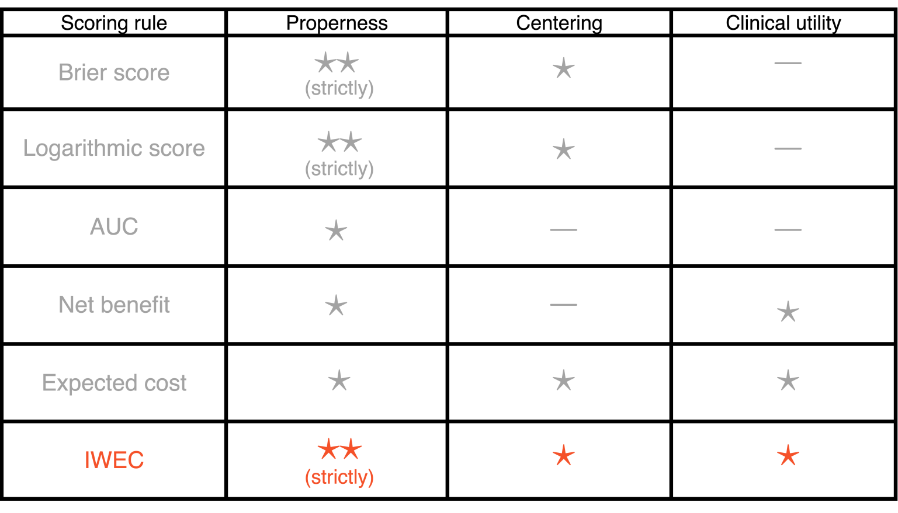

  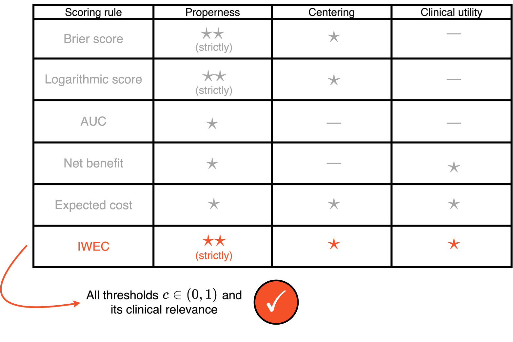

  

  

  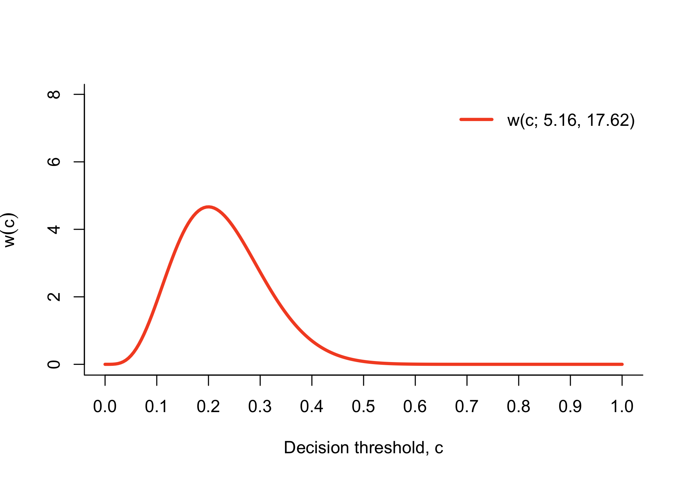

  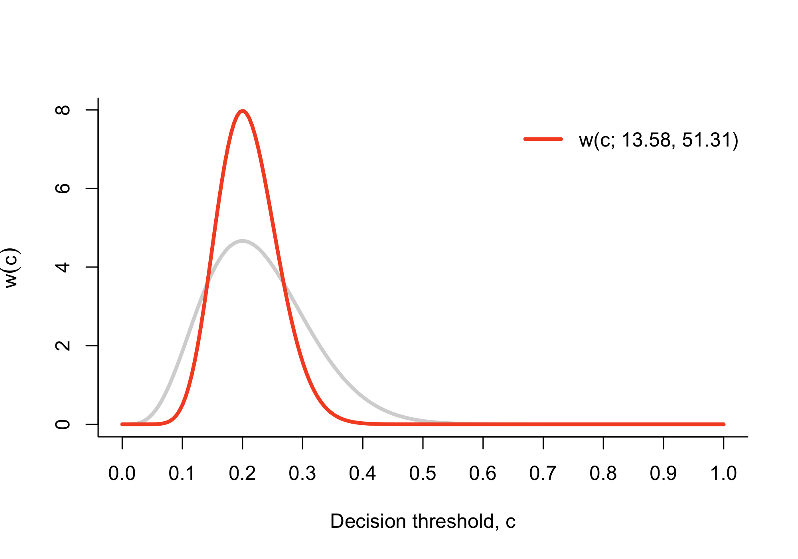

  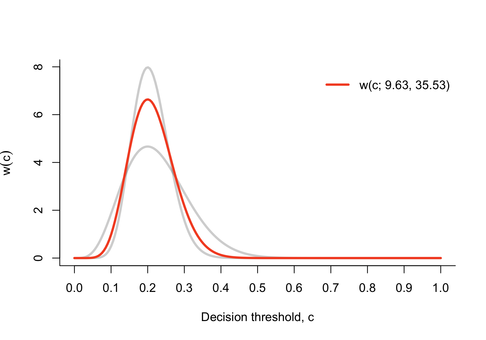

  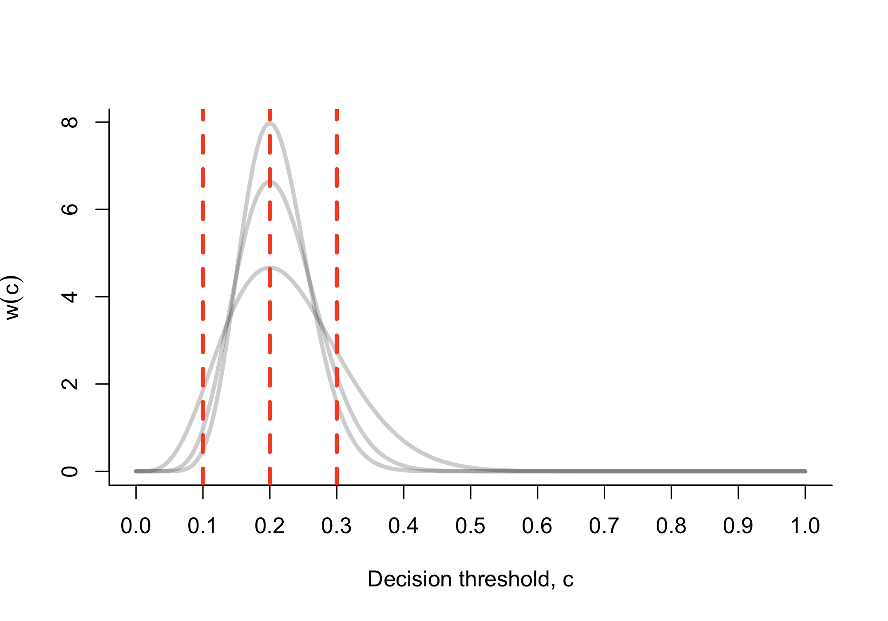

* A scoring rule is centered and strictly proper [$\Longleftrightarrow$]{style="color:#F55129;"} it can be represented by $\text{IWEC}_w \big(\pi_i(s\mid t), D_i(t,s)\big)$ for some $w(\cdot)$.
  + [$w(c)=1$]{style="color:#F55129;"} $\longrightarrow$ [Brier score]{style="color:#F55129;"}
  + [$w(c)=c^{-1}(1-c)^{-1}$]{style="color:#F55129;"} $\longrightarrow$  [logarithmic score]{style="color:#F55129;"}

## Estimation under LTRC data 

* To [estimate]{style="color:#F55129;"}:

$$\text{eIWEC}_w(t,s)=E\big[\text{IWEC}_w\big(\pi(s\mid t),D(t,s)\big) \mid T^*>t\big]$$

* We propose two approaches:
  + A nonparametric [IPW]{style="color:#F55129;"} estimator.
  + A [model-based]{style="color:#F55129;"} estimator.

* We established [consistency]{style="color:#F55129;"} and [asymptotic normality]{style="color:#F55129;"}.

## Application: OPTICORE 

* [Goal]{style="color:#F55129"} $\longrightarrow$ outperform current clinical practice for CCS administration.
* In the Netherlands:
  + [Strategy 1]{style="color:#F55129"} $\longrightarrow$ when pulsatility index of the umbilical artery becomes abnormal
  + [Strategy 2]{style="color:#F55129"} $\longrightarrow$ when an absent or reversed end-diastolic velocity of the umbilical artery is detected

- Shared-parameter [joint model]{style="color:#F55129;"} with fetal and maternal outcomes:

$$\scriptsize\begin{split} 
\textcolor{#F55129}{\text{JM}}:  h_{i}\left(t \mid \boldsymbol{\mathcal{H}}_{i}(t), \boldsymbol{X}_{i}\right) =h_{0}(t) \exp \left(  \gamma\boldsymbol{X}_{i} + \sum_{j=1}^6\alpha_j f_j\{\boldsymbol{\mathcal{H}}_{i}(t))\} \right) 
\end{split}$$

- $\boldsymbol{X}_{i}$ $\longrightarrow$ [baseline covariates]{style="color:#F55129;"} including age, smoking status, previous pregnancy, diabetes mellitus, etc. 

- Shared-parameter [joint model]{style="color:#F55129;"} with fetal and maternal outcomes:

$$\scriptsize\begin{split} 
\textcolor{#F55129}{\text{JM}}:  h_{i}\left(t \mid \boldsymbol{\mathcal{H}}_{i}(t), \boldsymbol{X}_{i}\right) =h_{0}(t) \exp \left(  \gamma\boldsymbol{X}_{i} + \sum_{j=1}^6\alpha_j f_j\{\boldsymbol{\mathcal{H}}_{i}(t))\} \right) 
\end{split}$$

- [Dynamic predictions]{style="color:#F55129;"} $\longrightarrow$  $(29, 30]$, $(30, 31]$ and $(31, 32]$ weeks of gestation. 
- We consider [$c\in(0.1,0.3)$]{style="color:#F55129;"} and [$w(c;5.16, 17.62)$]{style="color:#F55129;"}.

  

  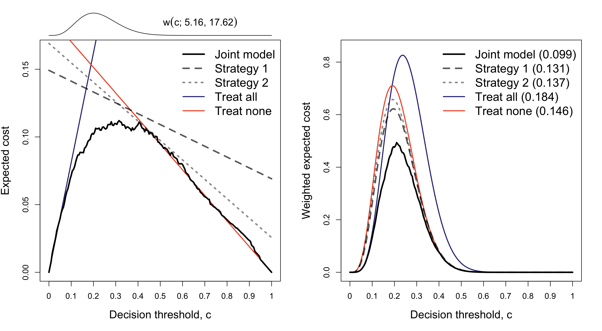

  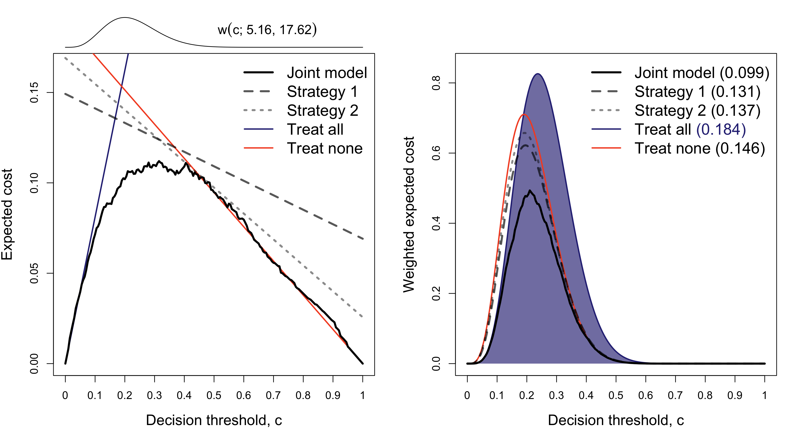

  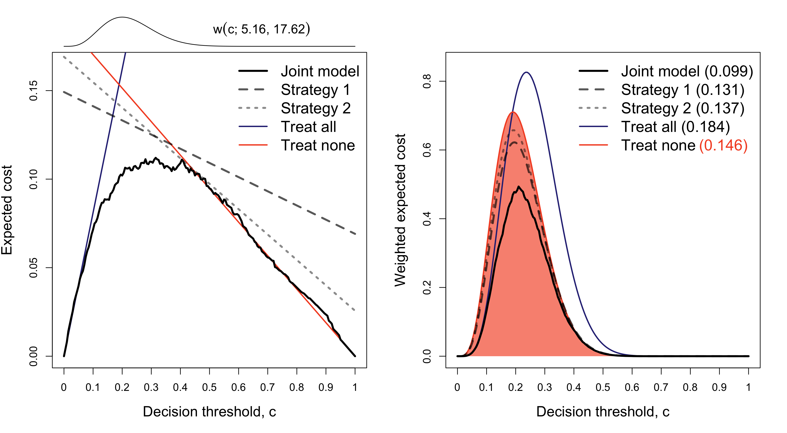

  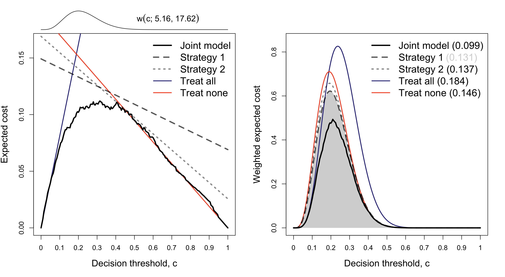

  

  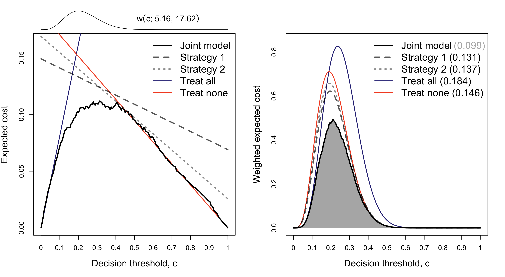

  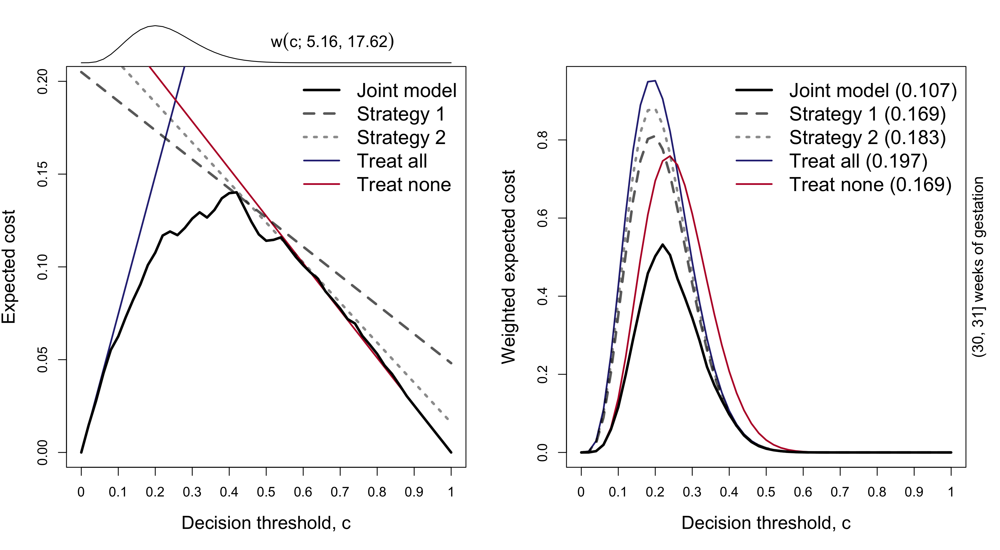

  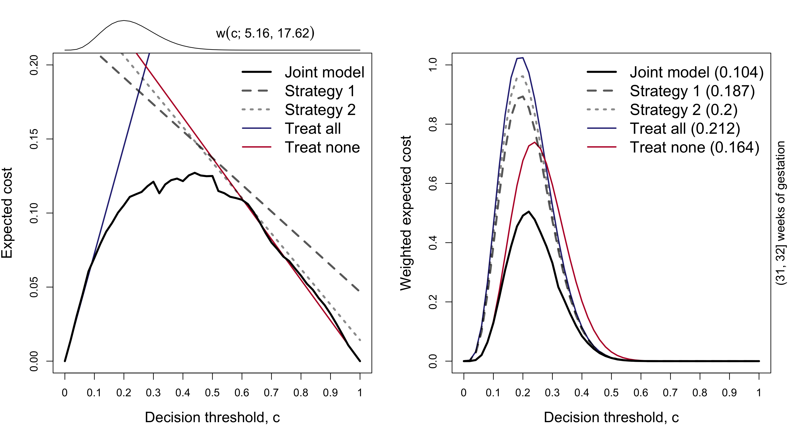

## Simulation study: results 

* [BS, AUC and logS]{style="color:#F55129;"} $\longrightarrow$ favored models with good accuracy and discrimination.

* [NB and IWEC]{style="color:#F55129;"} $\longrightarrow$ favored models that better reflected clinical value.

* [NB]{style="color:#F55129;"} $\longrightarrow$ sensitive to decision threshold misspecification.

* [IWEC]{style="color:#F55129;"} $\longrightarrow$ robust across weight functions.

## Contribution 

::: {.fragment .fade-in-then-out}

- [Extension of clinical utility]{style="color:#F55129;"} to dynamic prediction.
- [IWEC]{style="color:#F55129;"} and [weighted decision curves]{style="color:#F55129;"}.
- [A comprehensive estimation framework]{style="color:#F55129;"} for [LTRC data]{style="color:#F55129;"}. 
- Methods will be available in the [JMbayes2 R package]{style="color:#F55129;"}.

:::

## { data-state="cover-slide" data-background-image="images/contra.png" data-background-size="cover" visibility="uncounted"}

## Challenges of the data {visibility="uncounted"}

-   CCS cannot be administered until the fetus reaches [$500$ grams]{style="color:#F55129;"} and a gestational age of [$168$ days]{style="color:#F55129;"} ($24$ weeks).

  

## Challenges of the data {visibility="uncounted"}

- Under LTRC data $D_i(t,s)=\mathbf{1}\{t<T_i^*\leq t+s\}$ is [unobserved]{style="color:#F55129;"} for $i$ censored within $(t, t+s]$ or $L_i>t$.

- Under LTRC data $D_i(t,s)=\mathbf{1}\{t<T_i^*\leq t+s\}$ is [unobserved]{style="color:#F55129;"} for $i$ censored within $(t, t+s]$ or $L_i>t$.

## IPW estimator {visibility="uncounted"}

* We define the [IPW estimator]{style="color:#F55129;"}:

$$\scriptsize\require{color} \widehat{\text{eIWEC}}^{\text{IPW}}_w(t,s)=\frac{1}{n_t} \sum_{i:L_i<t<T_i} \widehat{W}_i(t,s)\text{IWEC}_w\big(\pi_i(s\mid t),\tilde{D}_i(t,s)\big)$$

  + $n_t$ $\longrightarrow$ number of individuals at risk at $t$
  + $\tilde{D}_i(t,s)=\mathbf{1}\{L_i<t<T_i\leq t+s\}$ $\longrightarrow$ observed binary indicator
  + $\widehat{W}_i(t,s)$  $\longrightarrow$ adjust for LTRC data via left-truncated Kaplan--Meier of the censoring distribution

* We define the [IPW estimator]{style="color:#F55129;"}:

$$ \scriptsize\require{color}\widehat{\text{eIWEC}}^{\text{IPW}}_w(t,s)=\frac{1}{\textcolor{#F55129}{n_t}} \sum_{i:L_i<t<T_i} \widehat{W}_i(t,s)\text{IWEC}_w\big(\pi_i(s\mid t),\tilde{D}_i(t,s)\big)$$

  + $\textcolor{#F55129}{n_t}$ $\longrightarrow$  number of individuals at risk at $t$
  + $\tilde{D}_i(t,s)=\mathbf{1}\{L_i<t<T_i\leq t+s\}$ $\longrightarrow$ observed binary indicator
  + $\widehat{W}_i(t,s)$ $\longrightarrow$  adjust for LTRC data via left-truncated Kaplan--Meier of the censoring distribution
  

* We define the [IPW estimator]{style="color:#F55129;"}:

$$\scriptsize\require{color} \widehat{\text{eIWEC}}^{\text{IPW}}_w(t,s)=\frac{1}{n_t} \sum_{i:L_i<t<T_i} \widehat{W}_i(t,s)\text{IWEC}_w\big(\pi_i(s\mid t),\textcolor{#F55129}{\tilde{D}_i(t,s)}\big)$$

  + $n_t$ $\longrightarrow$  number of individuals at risk at $t$
  + $\textcolor{#F55129}{\tilde{D}_i(t,s)}=\mathbf{1}\{L_i<t<T_i\leq t+s\}$ $\longrightarrow$ observed binary indicator
  + $\widehat{W}_i(t,s)$ $\longrightarrow$ adjust for LTRC data via left-truncated Kaplan--Meier of the censoring distribution

* We define the [IPW estimator]{style="color:#F55129;"}:

$$\scriptsize\require{color} \widehat{\text{eIWEC}}^{\text{IPW}}_w(t,s)=\frac{1}{n_t} \sum_{i:L_i<t<T_i} \textcolor{#F55129}{\widehat{W}_i(t,s)}\text{IWEC}_w\big(\pi_i(s\mid t),\tilde{D}_i(t,s)\big)$$

  + $n_t$ $\longrightarrow$  number of individuals at risk at $t$
  + $\tilde{D}_i(t,s)=\mathbf{1}\{L_i<t<T_i\leq t+s\}$ $\longrightarrow$ observed binary indicator
  + $\textcolor{#F55129}{\widehat{W}_i(t,s)}$ $\longrightarrow$  adjust for LTRC data via left-truncated Kaplan--Meier of the censoring distribution

* [The weights]{style="color:#F55129;"}:

$$\scriptsize \begin{split} \widehat{W}_i(t,s)=&\frac{\mathbf{1}\{T_i>t+s\}\mathbf{1}\{L_i<t\}}{\widehat{G}(t+s\mid t)} + \frac{\mathbf{1}\{L_i<t<T_i\leq t+s\} \delta_i}{\widehat{G}(T_i\mid t)}\\
& + 0\cdot \mathbf{1}\{L_i<t<T_i\leq t+s\} (1-\delta_i)
\end{split}$$

+ Individuals censored within $(t,t+s]$ do not contribute.

## Model-based estimator {visibility="uncounted"}

* We define the [model-based estimator]{style="color:#F55129;"}:

$$\scriptsize\require{color}\begin{split}
        \widehat{\text{eIWEC}}^{\text{MB}}_w(t,s)=  \frac{1}{n_t}&\sum_{i=1}^n  \delta_i\mathbf{1}\{L_i<t<T_i\leq t+s\}\text{IWEC}_w\{\pi_i(s\mid t),1\} \\
        &+ \mathbf{1}\{T_i>t+s\}\mathbf{1}\{L_i<t\}\text{IWEC}_w\{\pi_i(s\mid t),0\} \\
        & + (1-\delta_i)\mathbf{1}\{L_i<t<T_i\leq t+s\}\left[\pi_i(s\mid T_i)\text{IWEC}_w\{\pi_i(s\mid t),1\} \\         + (1-\pi_i(s\mid T_i))\text{IWEC}_w\{\pi_i(s\mid t),0\} \right].
    \end{split}$$

* We define the [model-based estimator]{style="color:#F55129;"}:

$$\scriptsize\require{color}\begin{split}
        \widehat{\text{eIWEC}}^{\text{MB}}_w(t,s)=  \frac{1}{n_t}&\sum_{i=1}^n  \textcolor{#F55129}{\delta_i\mathbf{1}\{L_i<t<T_i\leq t+s\}}\text{IWEC}_w\{\pi_i(s\mid t),\textcolor{#F55129}{1}\} \\
        &+ \mathbf{1}\{T_i>t+s\}\mathbf{1}\{L_i<t\}\text{IWEC}_w\{\pi_i(s\mid t),0\} \\
        & + (1-\delta_i)\mathbf{1}\{L_i<t<T_i\leq t+s\}\left[\pi_i(s\mid T_i)\text{IWEC}_w\{\pi_i(s\mid t),1\} \\         + (1-\pi_i(s\mid T_i))\text{IWEC}_w\{\pi_i(s\mid t),0\} \right].
    \end{split}$$

* We define the [model-based estimator]{style="color:#F55129;"}:

$$\scriptsize\require{color}\begin{split}
        \widehat{\text{eIWEC}}^{\text{MB}}_w(t,s)=  \frac{1}{n_t}&\sum_{i=1}^n  \delta_i\mathbf{1}\{L_i<t<T_i\leq t+s\}\text{IWEC}_w\{\pi_i(s\mid t),1\} \\
        &+ \textcolor{#F55129}{\mathbf{1}\{T_i>t+s\}\mathbf{1}\{L_i<t\}}\text{IWEC}_w\{\pi_i(s\mid t),\textcolor{#F55129}{0}\} \\
        & + (1-\delta_i)\mathbf{1}\{L_i<t<T_i\leq t+s\}\left[\pi_i(s\mid T_i)\text{IWEC}_w\{\pi_i(s\mid t),1\} \\         + (1-\pi_i(s\mid T_i))\text{IWEC}_w\{\pi_i(s\mid t),0\} \right].
    \end{split}$$

* We define the [model-based estimator]{style="color:#F55129;"}:

$$\scriptsize\require{color}\begin{split}
        \widehat{\text{eIWEC}}^{\text{MB}}_w(t,s)=  \frac{1}{n_t}&\sum_{i=1}^n  \delta_i\mathbf{1}\{L_i<t<T_i\leq t+s\}\text{IWEC}_w\{\pi_i(s\mid t),1\} \\
        &+ \mathbf{1}\{T_i>t+s\}\mathbf{1}\{L_i<t\}\text{IWEC}_w\{\pi_i(s\mid t),0\} \\
        & + \textcolor{#F55129}{(1-\delta_i)\mathbf{1}\{L_i<t<T_i\leq t+s\}}\left[\textcolor{#F55129}{\pi_i(s\mid T_i)}\text{IWEC}_w\{\pi_i(s\mid t),\textcolor{#F55129}{1}\} \\
        + \textcolor{#F55129}{(1-\pi_i(s\mid T_i))}\text{IWEC}_w\{\pi_i(s\mid t),\textcolor{#F55129}{0}\} \right].
    \end{split}$$

## Large sample properties  {visibility="uncounted"}

* We demonstrated that both the IPW and model-based estimators are:
  + [Consistent]{style="color:#F55129;"}
  + [Asymptotically normal]{style="color:#F55129;"} 

* This result applies to [all centered strictly proper metrics]{style="color:#F55129;"}:
  + [Brier score]{style="color:#F55129;"}
  + [Logarithmic score]{style="color:#F55129;"} 

## The joint model {visibility="uncounted"}

- [Linear mixed-effects]{style="color:#F55129;"} submodels:

$$ \require{color} Y_{ji}(t) = m_{ji}(t) + \varepsilon_{ji}(t), \quad j=1,\dots, 6 $$

- $m_{ji}(t)=\mathcal{F}\left(t;\boldsymbol{\beta}^j, \boldsymbol{b}^j_i\right)$ $\longrightarrow$ natural cubic splines
- $\varepsilon_{ji}(t)\sim N(0,\sigma^2)$
- [Outcomes]{style="color:#F55129;"} $\longrightarrow$ pulsatility index of the umbilical artery and the middle cerebral artery, estimated fetal weight and short-term heart-rate variability, diastolic and systolic blood pressure.

- [Time-to-event]{style="color:#F55129;"} submodel:

$$\scriptsize\begin{split} 
\textcolor{#F55129}{\text{JM}}:  h_{i}\left(t \mid \boldsymbol{\mathcal{H}}_{i}(t), \boldsymbol{X}_{i}\right) =h_{0}(t) \exp \left(  \gamma\boldsymbol{X}_{i} + \sum_{j=1}^4\alpha_j f_j\{m_{ji}(t)\} \right) 
\end{split}$$

- $\boldsymbol{X}_{i}$ $\longrightarrow$ baseline covariates including age, smoking status, previous pregnancy, diabetes mellitus, etc. 
- Functional forms $\longrightarrow$ $f_j(t)=(m_{ji}(t)-m_{ji}(t-7))/7$ for $j=1,2,3,5,6$ and $f_4(t)=\frac{1}{7}\int_{t-7}^tm_{4i}(z)dz$.

## Simulation study {visibility="uncounted"}

* We [evaluate dynamic predictions]{style="color:#F55129;"} within $(1,3]$ obtained via three Cox proportional-hazards models:
  + The true model $\longrightarrow$ [$M_\text{True}$]{style="color:#F55129;"}
  + Two misspecified models $\longrightarrow$ [$M_1, M_2$]{style="color:#F55129;"}

* To reflect the [asymmetry between FP and FN]{style="color:#F55129;"} in our clinical context, we set [$c\in(0.1, 0.3)$]{style="color:#F55129;"}.

  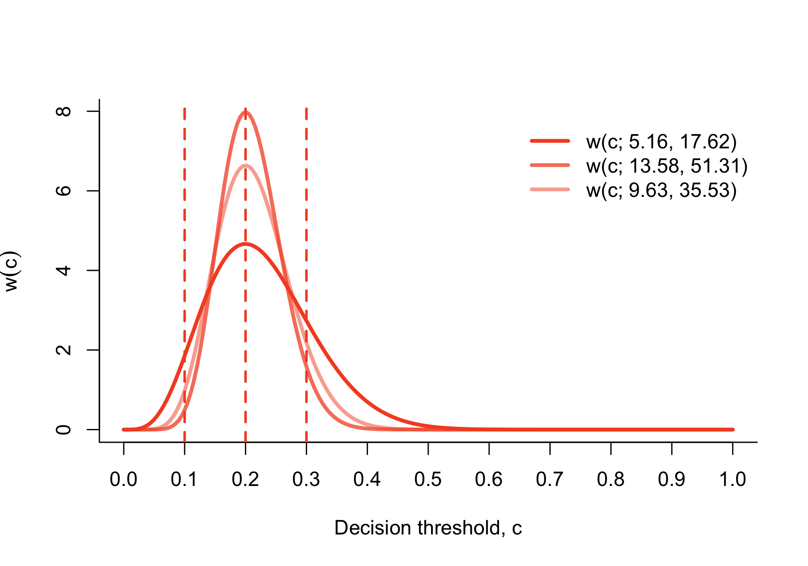

  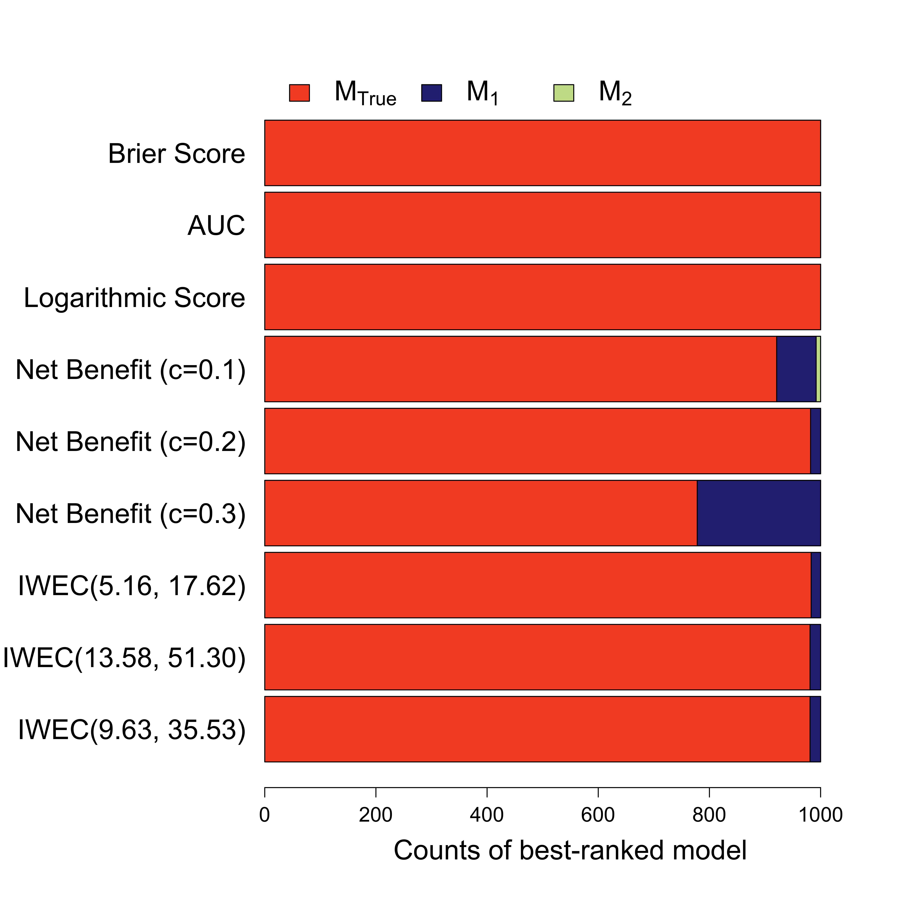

  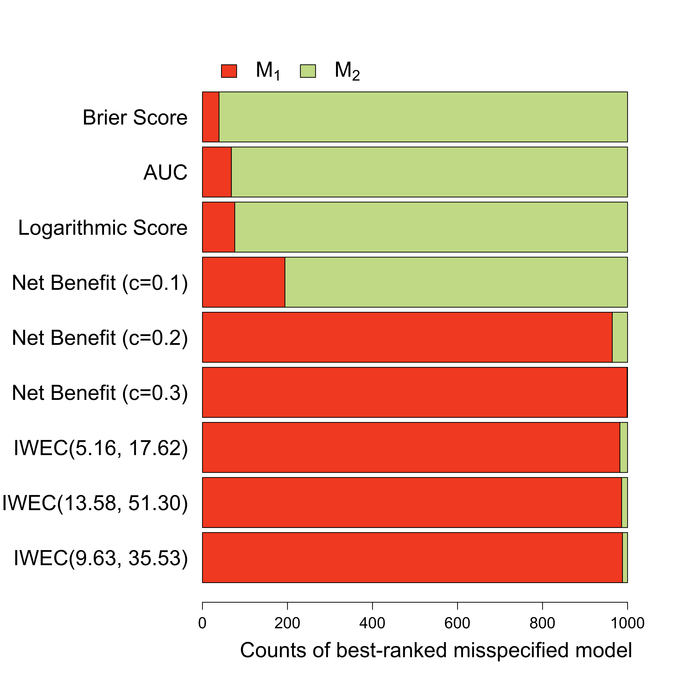

